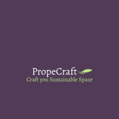

# PropeCraft
## The moto of PropeCraft is "Crafting Sustainable Spaces, Preserving Our Planet"
## Click! Upload! Recommend! Educate!

PropeCraft is to help you craft your dream sustainable space. We provide ideas, recommendations, and tips for sustainable and eco-friendly interior design, home decor, and living.

Features:

Makeover Visualizations: Get visualizations and recommendations for interior design and decorative ideas tailored to your space.
Balcony Designs: Discover creative and sustainable designs for your balcony or outdoor space.
Choose Your Colors & Paints: Explore a range of colors and paints that are eco-friendly and sustainable for your home.
Gardening Designs: Find inspiration for sustainable and eco-friendly gardening ideas to enhance your living space.

## Contents

1. [Short description](#short-description)
1. [Demo video](#demo-video)
1. [Long description](#long-description)
1. [Project roadmap](#project-roadmap)
1. [Getting started](#getting-started)
1. [Authors](#authors)
1. [License](#license)

## Short description
 ideas, recommendations, and tips for sustainable and eco-friendly designs with our super advanced AI tool.

### What's the problem?
Sustainable architectural design is crucial for reducing the environmental impact of the construction industry. It helps conserve natural resources, reduce energy consumption, minimize waste generation, improve indoor air quality, and mitigate biodiversity loss. Additionally, it offers economic benefits, such as cost savings and increased property values. As regulations and standards promoting sustainability increase, adopting sustainable architectural design practices becomes more important for a greener future.

### How can technology help?

With PropeCraft, we aim to revolutionize sustainable living through technology. By leveraging advanced AI and data analytics, we want to provide users with personalized recommendations and insights for creating eco-friendly and sustainable living spaces. Through interactive tools and visualizations, users can explore various design options, materials, and energy-efficient solutions tailored to their needs. 

We want to empower users to make informed decisions that not only enhance their living spaces but also contribute to a healthier planet.

### The idea

It's imperative to enable access to sustainable living solutions through technology backed by Google Generative AI tools.

## Demo video

1. The user navigates to the app and uploads an image file.
2. Within the code engine, front end parses and send it to Router.
3. The Router processes it and sends the image to AI/ML(aistudio_gemini_prompt_freeform) engine via APIs
4. The AI/ML(Google Generative AI) tool deeply analyze and process the image and then returns the response with suggestions/ideas
5. Router parses and hands the result to front end
6. Output is given to the user in regional text.

## Long description

PropeCraft is to help you craft your dream sustainable space. We provide ideas, recommendations, and tips for sustainable and eco-friendly interior design, home decor, and living.

Features:

Makeover Visualizations: Get visualizations and recommendations for interior design and decorative ideas tailored to your space.
Balcony Designs: Discover creative and sustainable designs for your balcony or outdoor space.
Choose Your Colors & Paints: Explore a range of colors and paints that are eco-friendly and sustainable for your home.
Gardening Designs: Find inspiration for sustainable and eco-friendly gardening ideas to enhance your living space.
With this, Crop Doctor helps farmers to tackle the high level of uncertainty  and destruction in crop plantations.

## What Next ?

Next, PropeCraft is the integration of a language translation model to make the platform more accessible to users from diverse linguistic backgrounds, we are planning to expand its platform to include a wider range of sustainable living solutions beyond interior design. This includes tips for energy efficiency, waste reduction, water conservation, and more. And also plans to integrate community features, allowing users to share their own sustainable home projects and ideas, creating a vibrant community of like-minded individuals committed to sustainable living.

## Getting started

## Setup

This code works on Python3+ versions.

## Clone the repository

## With Docker:

$ git clone https://github.com/PropeCraft/WebApp.git

$ WebApp/

## Install Docker
https://docs.docker.com/engine/install/ubuntu/

## Build docker image

$ docker build -t propecraft_docker .

Note: ensure in app.py port is mentioned as 8080

$ docker run -it -p 8080:8080 propecraft_docker

In Browser run with 127.0.0.1:8080

## To push:

$docker login

  Username: XXXX

  Password: XXXX

$ docker tag propecraft_docker propecraft/propecraft_docker:1.0.0

$ docker push propecraft/propecraft_docker:1.0.0

## Without Docker:

## Install the required libraries

$ pip3 install -r requirements.txt

## Clone the repository

$ git clone https://github.com/PropeCraft/WebApp.git

$ webApp/

## Run app.py

$ python3 app.py

or

$ python -m flask run

In Browser run with 127.0.0.1:5000

## Authors
- **Suneetha Jonadula** - _Lead Developer_

## License

This project is licensed under the Apache 2 License - see the [LICENSE](LICENSE) file for details.

